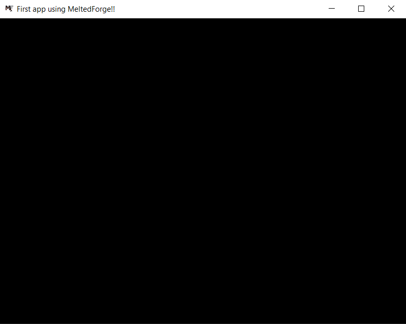
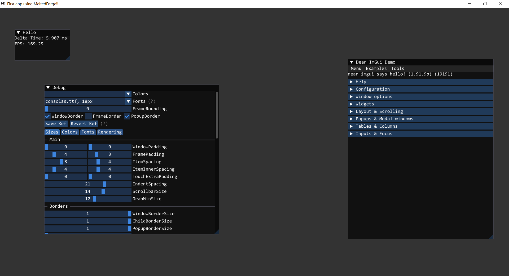

# First app

This page guides you through your first app using MeltedForge's core.
It is a quick guide to get a gist of how things get going, and this is not a full tutorial or a complete 
documentation. It is meant to get things up and running as soon as possible while also explaining things and there alternatives.

!!! Info
    - For this guide, it is recommended to have some basic knowledge of C and a little bit about graphics rendering since things may get a little technical.
    - Also, we are not going into too much depth like explaining what is what and how and why things are the way they are.

---

## Entry point

When using MeltedForge, you won't be writing the usual `main()` function. Instead, it is expected from the client 
it provides a implementation of the function `mfClientCreateAppConfig`. Here is its signature: 

```c title="main.c"

#define MF_INCLUDE_ENTRY
#include <mf.h>

MFAppConfig mfClientCreateAppConfig() {
    ... // Client code
}

```

!!! Info
    For getting the engine core's API declarations, including only `mf.h` should suffice.

!!! Info
    The macro `MF_INCLUDE_ENTRY` should be defined before including `mf.h`, only in a single .c/.cpp file of the client, since it signals the engine to enclude the `main` function. This is because there might be multiple .c/.cpp files including `mf.h` which would instead create multiple definitions of the `main` function.

---

## The app config

The `mfClientCreateAppConfig` is expected to return a typedefed struct called `MFAppConfig`, which contains 
function pointers to common functions like initApp, runApp, etc. and options like enableDepth, enableUI, etc.

But in this guide, we won't be focusing on creating a custom app with custom app related function pointers. Instead 
we will be using the engine's `mfCreateDefaultApp(const char* appName)` which will generate a `MFAppConfig` for us. This generated app config has very minimal features by itself but can still be heavily customized.

Here is the minimum setup:

```c title="main.c"
#define MF_INCLUDE_ENTRY
#include <mf.h>

MFAppConfig mfClientCreateAppConfig() {
    MFAppConfig config = mfCreateDefaultApp("First app using MeltedForge!!");
    config.winConfig.resizable = true; // Setting the window so that it can be resized. By default this is set to false.
    config.enableDepth = true; // Enabling depth buffering (for 3D rendering). By default this is set to false.

    return config;
}

```

Since already mentioned, the default app is very minimal and doesn't do *anything* visually.  
So you should see something like this: 



---

## The layer system

MeltedForge supports a layer system in the default app so that the client can easily customize whatever they want and in a modular 
way too.

Here is a sample for your "first app":

```c title="main.c"
#define MF_INCLUDE_ENTRY
#include <mf.h>

struct Layer {
    MFVec3 color;
};

static void OnInit(void* layerState, void* pAppState) {
    Layer* state = (Layer*)layerState;
    MFDefaultAppState* appState = (MFDefaultAppState*)pAppState;
   
    state->color = (MFVec3){0.1f, 0.0f, 0.1f};
    mfRendererSetClearColor(appState->renderer, state->color);
    slogLogMsg(mfGetLogger(), SLOG_SEVERITY_INFO, "%f %f %f", state->color.r, state->color.g, state->color.b);
}

static void OnDeinit(void* layerState, void* pAppState) {
    Layer* state = (Layer*)layerState;
    MFDefaultAppState* appState = (MFDefaultAppState*)pAppState;
    // Client's custom code
}

static void OnRender(void* layerState, void* pAppState) {
    Layer* state = (Layer*)layerState;
    MFDefaultAppState* appState = (MFDefaultAppState*)pAppState;
    // Client's custom code
}

static void OnUpdate(void* layerState, void* pAppState) {
    Layer* state = (Layer*)layerState;
    MFDefaultAppState* appState = (MFDefaultAppState*)pAppState;
    // Client's custom code
}

static void OnUIRender(void* layerState, void* pAppState) {
    Layer* state = (Layer*)layerState;
    MFDefaultAppState* appState = (MFDefaultAppState*)pAppState;

    igDockSpaceOverViewport(igGetID_Str("Dockspace"), igGetMainViewport(), 0, 0);

    igShowStyleEditor(igGetStyle());
    igShowDemoWindow(mfnull);

    igBegin("Hello", mfnull, ImGuiWindowFlags_None);
    
    igText("Delta Time: %0.3f ms", mfRendererGetDeltaTime(appState->renderer));
    igText("FPS: %0.2f", 1000.0/mfRendererGetDeltaTime(appState->renderer));

    igEnd();
}

MFAppConfig mfClientCreateAppConfig() {
    MFAppConfig config = mfCreateDefaultApp("First app using MeltedForge!!");
    config.winConfig.resizable = true;
    config.enableDepth = true;
    config.enableUI = true;

    MFLayer layer{};
    layer.onInit = &OnInit;
    layer.onDeinit = &OnDeinit;
    layer.onRender = &OnRender;
    layer.onUIRender = &OnUIRender;
    layer.onUpdate = &OnUpdate;
    layer.state = MF_ALLOCMEM(Layer, sizeof(Layer));

    MFArray layers = mfArrayCreate(1, sizeof(MFLayer));
    mfArrayAddElement(layers, MFLayer, layer);
    config.layers = layers;

    return config;
}
```

Based on this first app's sameple, you should see something like this: 



!!! Note
     - The MFDefaultAppState contains these attributes:
        - MFWindow* window
        - MFRenderer* renderer
     - The `MFArray` utility struct is a custom dynamic array data structure for any data type, internally expressed as `void*` and 
    accessed based on the `elementSize` attribute provided
     - Every layer function signature contains these two parameters `void* layerState, void* appState`, which needs to be type casted 
     explicitly to their own original type to access their data.
     - In case any layer function pointer is `NULL/0`, then the engine doesnt panic, it just doesn't calls it.

!!! Tip
    If you have interest and want to see an example which demonstrates every feature of the engine in a single `MFLayer`, then feel free to read the source code of the `MFTest` app. Link [here](https://github.com/CloudCodingSpace/MeltedForge/tree/main/MFTest)